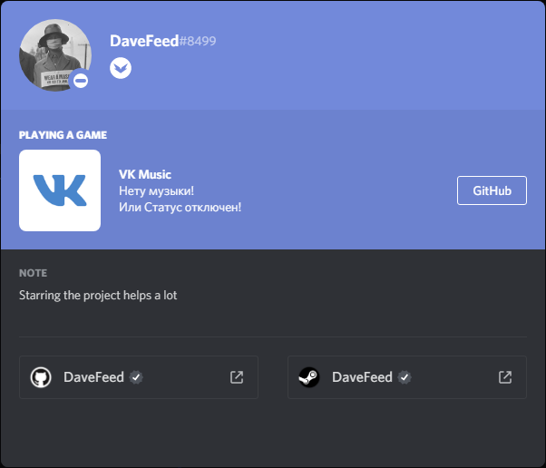
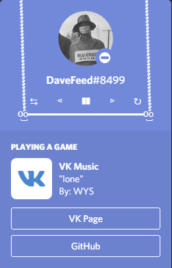
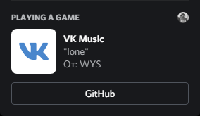
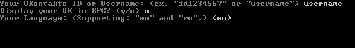
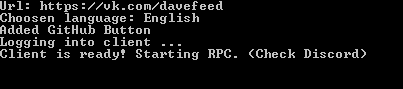

# VK Music RPC for Discord
 
VK Music RPC for displaying Music and Author. 
Currently supporting 2 languages: English and Russian! 

## Demonstration In Discord

## Instalation
### Packing the code yourself
- Download the code
- Do `npm install` in the main folder
- Install pkg module `npm install -g pkg`
- Pack the main folder files using package.json `pkg .`
- Go to the setup folder, and do the same steps

You can download the latest build from [releases](https://github.com/DaveFeed/VK-Music-RPC-for-Discord/releases). 

### Using the software
After you got the main executable and setuper, run the setuper. 
1. Pass your vk id or your url name. (ex: https://vk.com/id1234567 or https://vk.com/username) 
2. Choose if you want to have a button in RPC, which links to your profile or not. 
3. Choose language from the list, or leave it blank for English. 

After the setup, you are good to go! Just run the main executable when discord app is on. 

### Possible Error Codes
- Error code 0: The setup is not done, or is done purely, or the file is damaged. To fix this redo the setup.
- Error code 1: This is not an error, if it doesn't stop, then there is error with the code, or with the client part.
- Error code 2: The link to account is invalid, or there are server issues. This only happens when server throws >=400 errors
- Error code 3: Discord is not turned on. You need to turn discord on before running this file. This will be fixed in other versions.

### Next Tasks
- [x] Add pictures to Readme
- [ ] Change the code to work with VK API
- [ ] Add other languages too
- [ ] Fix Timeouts so console doesn't close 
- [ ] Add other os version executables in [releases](https://github.com/DaveFeed/VK-Music-RPC-for-Discord/releases).
